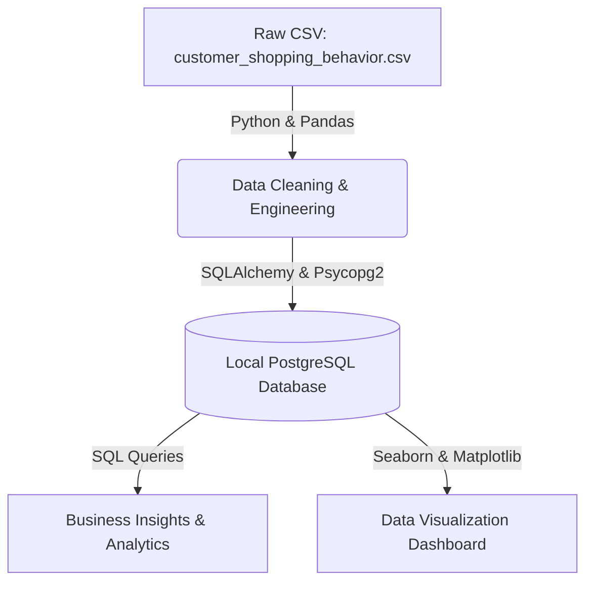

# 🛍️ Retail Customer Behavior & Purchase Pattern Analysis

An end-to-end data engineering and analytics pipeline designed to ingest, clean, transform, and analyze retail customer shopping transactions. This project demonstrates database migration, SQL querying, and data visualization to drive business decisions.

---

## 🏗️ Project Architecture & Data Flow



---

## 🛠️ Tech Stack & Tools

* **Programming Languages:** Python 3.11, SQL (PostgreSQL Dialect)
* **Libraries:** Pandas, Matplotlib, Seaborn, SQLAlchemy, Psycopg2
* **Database Management:** PostgreSQL, DBeaver GUI Client
* **Development Environment:** Anaconda (Conda Virtual Environment), Jupyter Notebook

---

## 📈 Key Business Insights & Strategic Recommendations

### 1. Discount Policy Optimization (Pricing Strategy)
* **Finding:** Customers who applied a discount code had an average spend of **$59.28**, which is slightly *lower* than the average spend of customers who did not use discounts (**$60.13**).
* **Business Impact:** The current flat-discount structure dilutes profit margins without successfully driving larger cart sizes or transaction values.
* **Recommendation:** Replace flat discounts with minimum-spend thresholds (e.g., *"Spend $75 or more and get 15% off"*). This forces customers to add more items to their carts to qualify for savings, boosting Average Order Value (AOV).

### 2. Seasonal Inventory Management
* **Finding:** **Clothing** sales peak during **Spring** ($27.7k) and **Winter** ($27.3k) but experience a drop during **Summer** ($23k). Conversely, **Accessories** see sales peaks during **Fall** and **Summer**.
* **Business Impact:** Misaligned stock allocations lead to high storage costs for unsold items and stockouts for high-demand items.
* **Recommendation:** Optimize warehousing schedules by reducing summer clothing inventory and scaling up accessories production/procurement ahead of the fall season.

### 3. Demographic Checkout Customization
* **Finding:** **Middle-aged** customers show a strong preference for **PayPal** as their primary checkout payment method, while **Seniors** and **Young Adults** prefer **Credit Cards** and **Cash**.
* **Business Impact:** Payment frictions during checkout cause cart abandonment.
* **Recommendation:** Implement dynamic checkout UI styling. If the logged-in user is middle-aged, surface the PayPal option at the top of the payment screen to create a frictionless purchasing flow.

---

## 📂 Project Repository Structure

* `Customer_Shopping_Behavior_Analysis.ipynb` — The primary Jupyter notebook containing data ingestion, cleaning, feature engineering, visualizations, and database loader scripts.
* `customer_shopping_behavior.csv` — The raw retail transactions dataset.
* `Customer_Shopping_Behavior_Analysis.sql` — Raw SQL scripts executing business queries against the PostgreSQL database.
* `PostgreSQL_Setup.md` — Reference guide documenting PostgreSQL installation, local network setup, and connection configurations.

---

## 🚀 Setup & Execution Guide

### Prerequisites
* Anaconda / Miniconda installed on your machine.
* PostgreSQL 16 installed and running.

### 1. Clone the Repository & Configure Environment
Open your terminal and run:
```bash
# Clone the repository
git clone https://github.com/your-username/retail-shopping-behavior-analysis.git
cd retail-shopping-behavior-analysis

# Create and activate the conda environment
conda create -n ds_env python=3.11 jupyter ipykernel -y
conda activate ds_env

# Install required packages
pip install pandas sqlalchemy psycopg2-binary matplotlib seaborn
```

### 2. Run the Notebook
1. Open the folder in VS Code or run `jupyter notebook` in your terminal.
2. Select the **`ds_env`** kernel.
3. Run the notebook cells from the top to import, clean, visualize, and upload the data.

### 3. Querying with SQL
Use a database client like **DBeaver** to connect to your database (`localhost:5432` / database: `customer_behavior`) using your local macOS user credentials. Open and run `Customer_Shopping_Behavior_Analysis.sql` to execute analytical queries directly against the database table.
